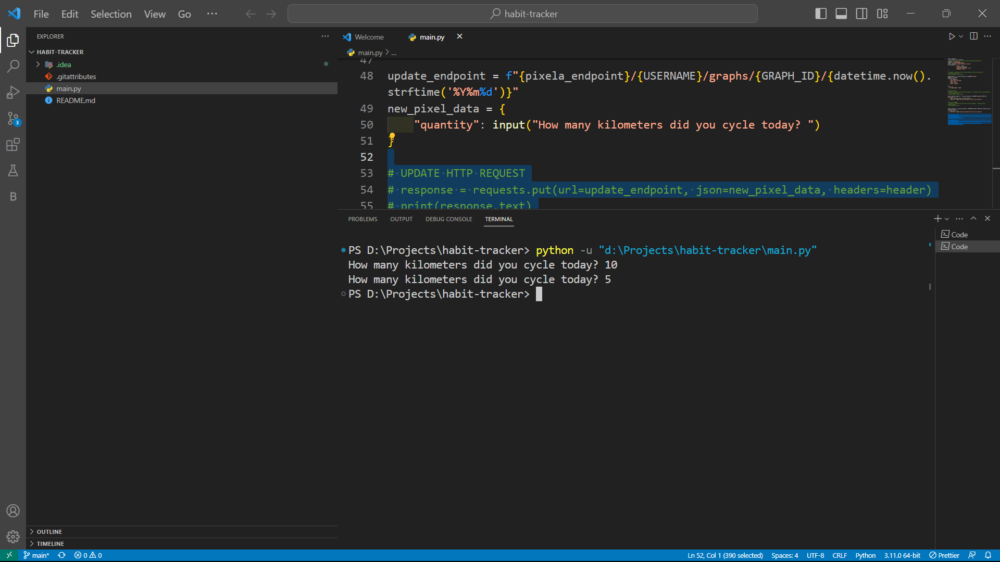
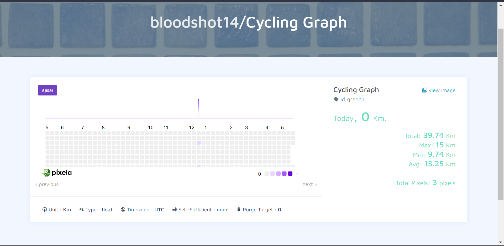

# Habit Tracker

The Habit Tracker project is a Python program that allows you to track and monitor your daily habits. With this tool, you can easily keep track of your progress and build positive habits over time.

## Features

- Habit Creation: Create and define your habits that you want to track.
- Daily Tracking: Log your progress for each habit on a daily basis.
- Habit Streak: Keep track of your consecutive days of completing a habit.
- Statistics: View insightful statistics and visualizations of your habit tracking history.
- Reminder System: Set reminders to help you stay on track with your habits.

## Installation

1. Clone the repository:

   ```bash
   git clone https://github.com/your-username/habit-tracker.git
   ```

2. Navigate to the project directory:

   ```bash
   cd habit-tracker
   ```

3. Install the required dependencies:

   ```bash
   pip install -r requirements.txt
   ```

4. Run the program:

   ```bash
   python habit_tracker.py
   ```

## Usage

1. Launch the program by running `habit_tracker.py` using Python.
2. Follow the on-screen instructions to navigate through the menu options.
3. Create habits, track your progress, and view statistics.

## Contributing

Contributions to the Habit Tracker project are welcome. If you have any ideas, suggestions, or bug reports, please submit them via GitHub issues or create a pull request.

## License

This project is licensed under the MIT License. See the [LICENSE](LICENSE) file for more details.

## Acknowledgements

The Habit Tracker project was inspired by the importance of building and maintaining positive habits. It aims to provide a simple and effective tool for personal habit tracking.

## Screenshots




Feel free to modify and enhance this README file to suit your project's specific needs.
